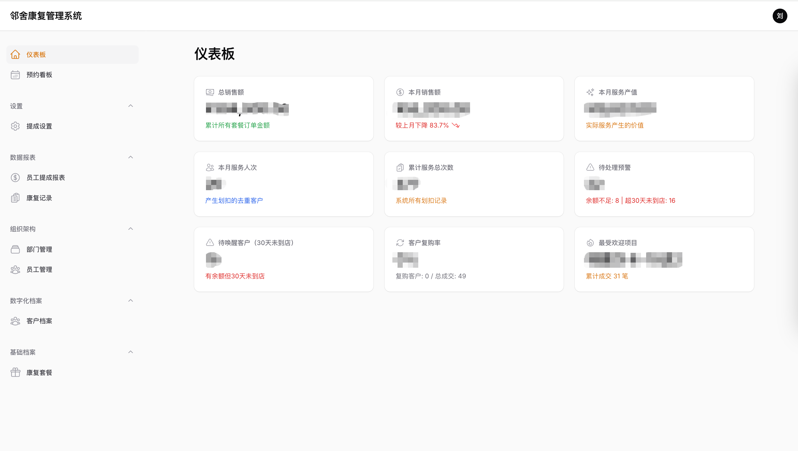
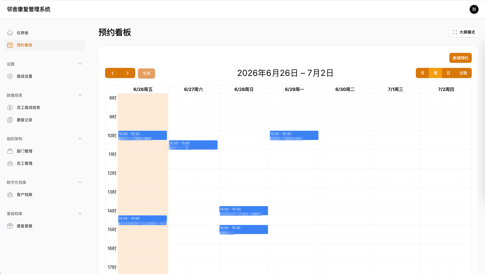
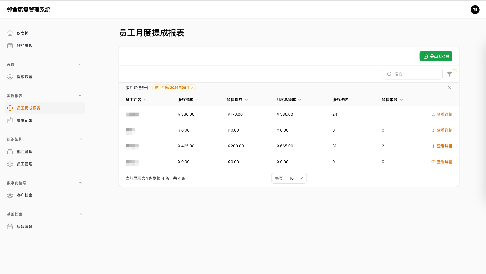
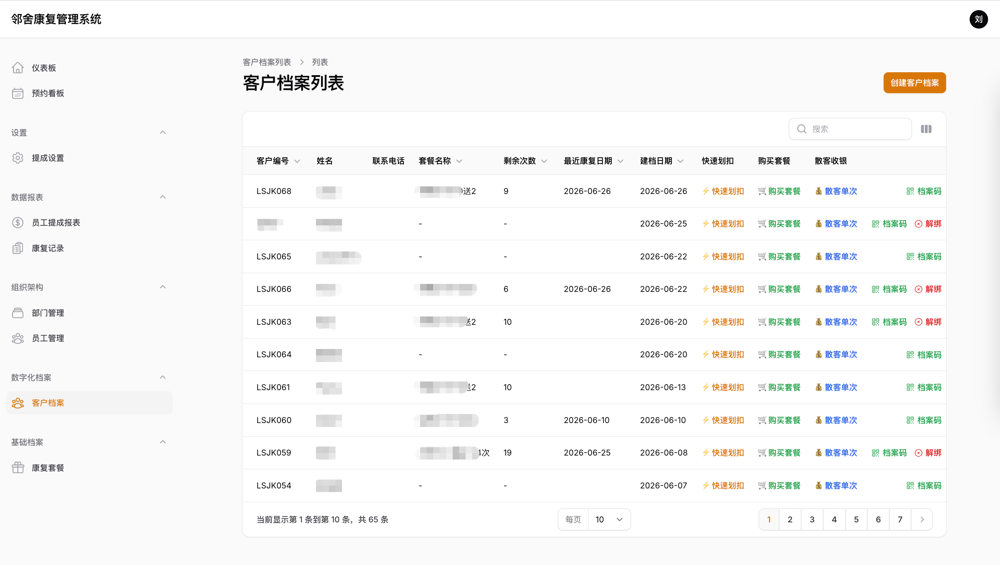

# RHIS — 康复健康信息管理系统

> 面向康复理疗机构的数字化管理平台，涵盖客户档案、康复评估、套餐管理、财务流水、预约看板、员工提成等核心业务模块。

---
## 系统截图





## 技术栈

| 类别 | 技术 | 版本 |
|------|------|------|
| 后端框架 | Laravel | 10.x |
| PHP | PHP | 8.1+ |
| 管理后台 | Filament | 3.x |
| 前端交互 | Livewire | 3.x |
| 样式框架 | Tailwind CSS | 3.x |
| 构建工具 | Vite | 5.x |
| 日历组件 | FullCalendar (saade/filament-fullcalendar) | 3.x |
| 微信 SDK | overtrue/laravel-wechat | 7.x |
| 二维码生成 | simplesoftwareio/simple-qrcode | 4.x |
| 图片处理 | Intervention Image | 3.x |
| Excel 导入导出 | maatwebsite/excel | 3.x |
| API 认证 | Laravel Sanctum | 3.x |
| 代码格式化 | Laravel Pint | 1.x |
| 测试框架 | PHPUnit | 10.x |

---

## 开发环境

### 系统要求

- PHP >= 8.1
- MySQL >= 5.7
- Composer
- Node.js >= 18 & npm

### 本地开发

```bash
# 1. 克隆项目
git clone <repository-url>
cd rhis

# 2. 安装依赖
composer install
npm install

# 3. 配置环境变量
cp .env.example .env
php artisan key:generate

# 4. 配置数据库（编辑 .env 中的 DB_* 配置项）

# 5. 执行迁移与数据填充
php artisan migrate --seed

# 6. 创建存储软链接
php artisan storage:link

# 7. 启动开发服务器
npm run dev          # 前端资源监听
php artisan serve    # 后端服务
```

### Docker 开发

项目使用 Docker 容器 `bt_dev_env`，容器内项目根目录为 `/www/wwwroot/linshe/rhis`。

```bash
# 执行 Artisan 命令
docker exec -w /www/wwwroot/linshe/rhis bt_dev_env php artisan migrate

# 生成 Filament 资源
docker exec -w /www/wwwroot/linshe/rhis bt_dev_env php artisan make:filament-resource PatientProfile

# 清理缓存
docker exec -w /www/wwwroot/linshe/rhis bt_dev_env php artisan optimize:clear
```

---

## 功能清单

### 模块一：组织架构管理

| 功能 | 状态 |
|------|------|
| 多级部门管理（树形结构） | ✅ |
| 员工管理（含部门多对多关联） | ✅ |
| 部门员工关联（主部门标记） | ✅ |

### 模块二：数据字典管理

| 功能 | 状态 |
|------|------|
| ICD 编码管理 | ✅ |
| 康复套餐管理（6种套餐类型、价格、延期、共享配置） | ✅ |

### 模块三：客户管理

| 功能 | 状态 |
|------|------|
| 客户档案管理（自动编号、详情页 Infolist + Tabs） | ✅ |
| 快速划扣（一键划扣 + 自动计算服务提成） | ✅ |
| 购买套餐（一键开单 + 自动计算销售提成） | ✅ |
| 散客收银（单次资产 + 瞬间划扣 + 算提成闭环） | ✅ |
| 微信绑定（持久化二维码、状态机分流、防重复绑定） | ✅ |

### 模块四：财务管理

| 功能 | 状态 |
|------|------|
| 客户套餐包管理（资产表、自动计算有效期、余额不足拦截） | ✅ |
| 消费记录管理（流水表、自动扣减、剩余次数快照） | ✅ |

### 模块五：康复专科 SOP

| 功能 | 状态 |
|------|------|
| 康复体态评估（基础体测、围度、柔软度、体态标签） | ✅ |
| 人体实景图谱画板（涂鸦标记、Base64压缩、WebP输出） | ✅ |
| 康复成效对比系统（2-5条记录对比、差值计算、打印报告） | ✅ |
| 影像对比记录管理（6角度拍照、移动端影像对比报告） | ✅ |

### 模块六：预约管理

| 功能 | 状态 |
|------|------|
| 预约看板（FullCalendar 日历视图、状态颜色区分） | ✅ |
| 大屏全屏模式（隐藏侧边栏/顶栏、日历撑满屏幕） | ✅ |
| 5分钟自动刷新、行高自适应、文本换行 | ✅ |

### 模块七：数据看板（Dashboard）

| 功能 | 状态 |
|------|------|
| 核心指标统计卡片（总销售额、本月销售额、服务产值、服务人次等） | ✅ |
| 月度销售额趋势折线图（过去12个月） | ✅ |

### 模块八：全量康复记录看板

| 功能 | 状态 |
|------|------|
| 只读看板（按日期倒序、badge样式、tooltip截断） | ✅ |
| 快捷跳转客户档案 | ✅ |

### 模块九：员工绩效与提成

| 功能 | 状态 |
|------|------|
| 提成设置（套餐级提成、销售提成比例） | ✅ |
| 划扣记录提成分配（员工多选、自动计算、平分） | ✅ |
| 员工月度提成报表（汇总 + 明细） | ✅ |

---

## 移动端功能

| 功能 | 状态 |
|------|------|
| 微信 OAuth 登录 | ✅ |
| 客户主页（套餐次数、消费流水、康复报告） | ✅ |
| 康复影像对比（按部位左右拼图、点击放大预览） | ✅ |
| 持久化二维码入口（签名校验、状态机分流） | ✅ |

---

## 核心数据表

| 表名 | 说明 |
|------|------|
| `users` | 员工表 |
| `departments` | 部门表 |
| `rehab_packages` | 康复套餐字典 |
| `patient_profiles` | 客户档案 |
| `patient_packages` | 客户套餐包（资产表） |
| `consumption_records` | 消费记录（流水表） |
| `physical_assessments` | 康复体态评估 |
| `imaging_records` | 影像记录 |
| `appointments` | 预约记录 |
| `consumption_record_user` | 划扣-员工关联（提成） |
| `commission_settings` | 全局提成设置 |

---

## 项目结构

```
app/
├── Filament/
│   ├── Pages/          # 自定义页面（预约看板、提成报表等）
│   ├── Resources/      # Filament 资源（客户、套餐、评估等）
│   └── Widgets/        # Dashboard 统计卡片和图表
├── Http/
│   ├── Controllers/
│   │   └── Mobile/     # 移动端控制器（Dashboard、报告、影像对比）
│   └── Middleware/     # 中间件
├── Models/             # Eloquent 模型
└── Providers/          # 服务提供者
resources/
├── views/
│   ├── filament/       # Filament 自定义视图
│   └── mobile/         # 移动端 Blade 视图
└── css/                # Tailwind 样式
routes/
└── web.php             # 路由定义
```

---

## 代码规范

- 代码格式化：`vendor/bin/pint`
- 测试运行：`php artisan test --compact`
- 提交前请确保通过 Pint 检查和测试

---

## 文档

- [功能清单](RHIS_FEATURE.md) — 详细功能模块说明
- [数据库表结构](RHIS_TABLE.md) — 完整表结构文档

---

## 许可证

本项目采用 [CC BY-NC 4.0](https://creativecommons.org/licenses/by-nc/4.0/deed.zh-hans) 协议。

> 允许个人学习、研究、非商业性使用，禁止用于任何商业目的。如需商用，请联系作者获取书面授权。
